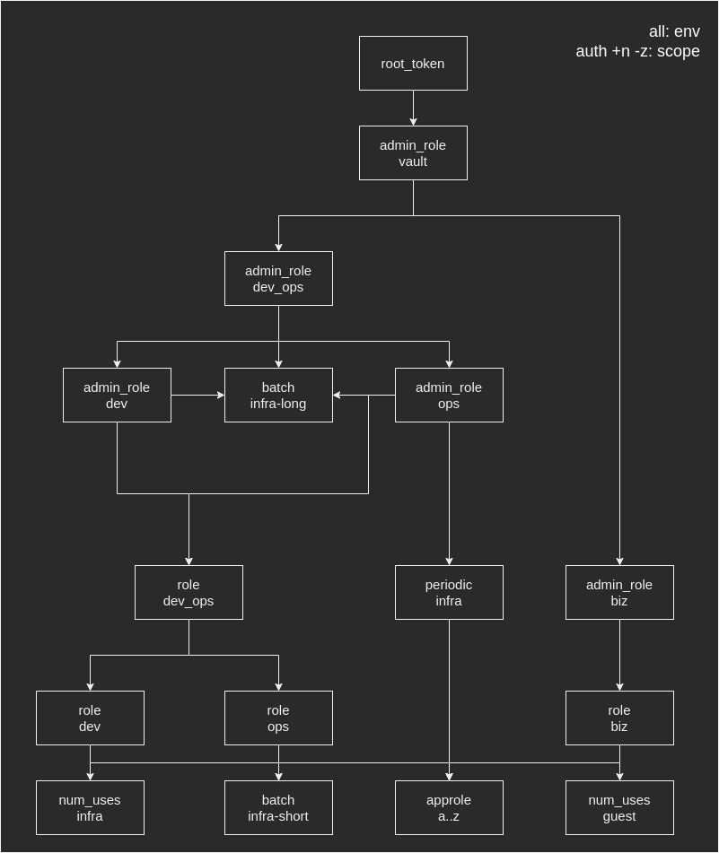
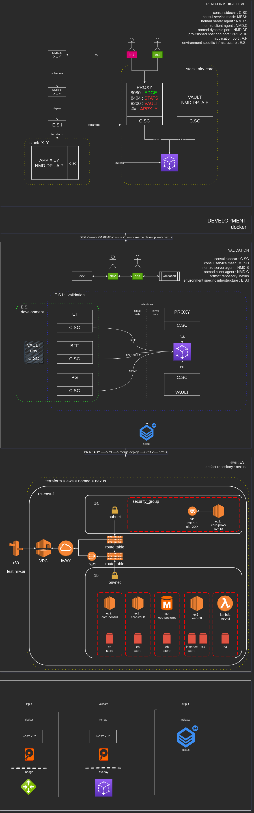
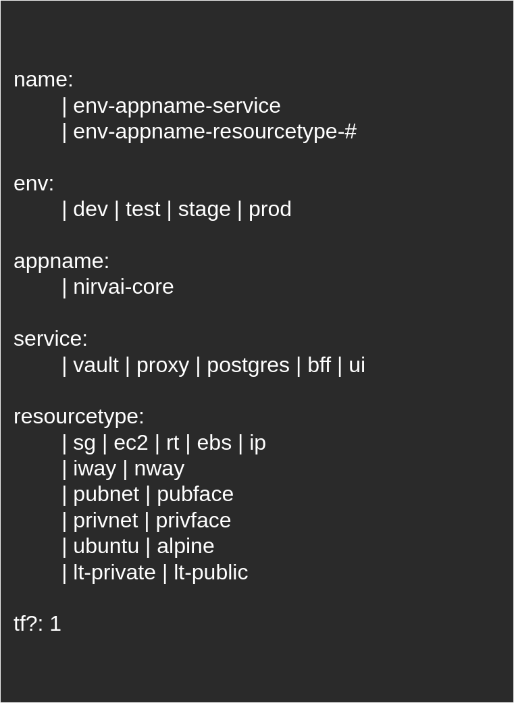

# NIRVai Architectural Desicion Records

documentation for architecture @ NIRVai

## RACEXP

- [NIRV DOCS project board](https://github.com/orgs/nirv-ai/projects/6/views/1?filterQuery=repo%3A%22nirv-ai%2Fdocs%22)
- [RACEXP docs](https://github.com/noahehall/theBookOfNoah/blob/master/0current/architectural%20thinking/0racexp.md)

## ADRs

### dev experience

- WIP

> 

### vault role hierarchy

- WIP

> 

### IaC

- WIP

> 

### aws tagging scheme

- WIP

> 
