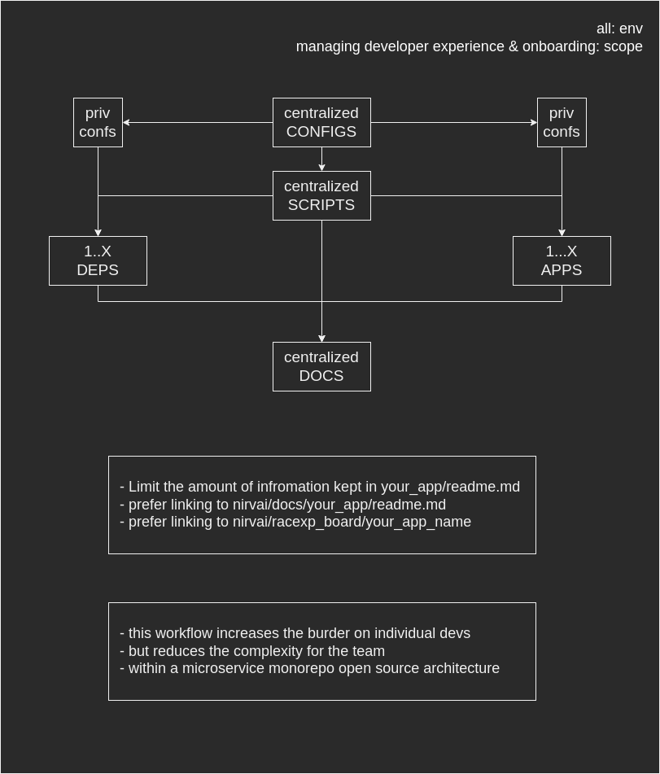

# nirvai CONFIGS

- [source code](https://github.com/nirv-ai/configs)

## RACEXP

- [NIRV CONFIGS project board](https://github.com/orgs/nirv-ai/projects/6/views/1?filterQuery=repo%3A%22nirv-ai%2Fconfigs%22)
- [RACEXP docs](https://github.com/noahehall/theBookOfNoah/blob/master/0current/architectural%20thinking/0racexp.md)

## Why static CENTRALIZED configuration

- its all about development, centralizing developer configs provide:
  - a base for bootstrapping any service to meet the minimum standard at NIRVai
  - enables service-specific overrides at build and runtime
  - rapid prototyping and deployment of changes across the entire platform
- production configuration is kept dynamic:
  - injectable and obfuscated at build and runtime
  - satisfies PoLP (principal of least privilege) without safeguarding insenstive data
- our goal is to achieve
  - complete open source platform
  - rapid prototyping of new services
  - the cultivaiton and promotion of collective developer intelligence
  - the fkn ability to boot the entire platform in development with 0 shortcuts or tradeoffs

### static configuration adr

### dynamic configuration adr

